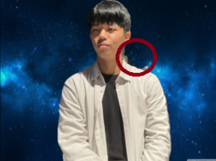

# AIFFEL Campus Online Code Peer Review Templete
- 코더 : 염철헌
- 리뷰어 : 손병진

# PRT(Peer Review Template)
- [x]  **1. 주어진 문제를 해결하는 완성된 코드가 제출되었나요?**
    1. 인물모드 사진을 성공적으로 제작하였다.
        인물과 동물 사진을 활용하여 성공적으로 segmentation을 수행하고 배경 수정도 진행함.

        
        

    2. 제작한 인물모드 사진들에서 나타나는 문제점을 정확히 지적하였다.
        인물이 입고있는 옷색상과 유사한 색상에 뒤에 나타나서 segmentation이 정밀하게 되지못한 부분을 체크.

        

    3.  인물모드 사진의 문제점을 개선할 수 있는 솔루션을 적절히 제시하였다.
        Depth 정보를 가지고 있는 Depth Estimation 모델을 활용하여 성능을 보완한다거나 CRF를 활용하여 경계를 보정하는 방식 등 다양한 해결방법을 고민하고 제시함.
    
- [x]  **2. 전체 코드에서 가장 핵심적이거나 가장 복잡하고 이해하기 어려운 부분에 작성된 주석 또는 doc string을 보고 해당 코드가 잘 이해되었나요?**
        배경 크로마키 변경 작업 시 배경을 치환하는 과정이나 코드가 적절하게 설명되어 있고 코드도 간결함.

        
        
- [x]  **3. 에러가 난 부분을 디버깅하여 문제를 해결한 기록을 남겼거나새로운 시도 또는 추가 실험을 수행해봤나요?**
        로컬에서 작업 시 발생하는 오류에 대하여 해당 문제를 해결해가는 과정을 기록함.

        
        
- [x]  **4. 회고를 잘 작성했나요?**
        프로젝트의 목표에 대한 생각을 잘 기록해두었음.

        
        
- [x]  **5. 코드가 간결하고 효율적인가요?**
        코드가 간결하고 주석을 통해 가독성이 높임

        

# 회고(참고 링크 및 코드 개선)

짧은 시간에도 프로젝트 목표를 수행하였고, Depth Estimation 모델이나 CRF(Conditional random fields) 등의 방식을 고려해볼만한것 같다.
많은 분들이 로컬에서 작업 시 문제를 겪었는데 이를 해결하고 리뷰를 남겨놓은 부분도 인상깊다.

